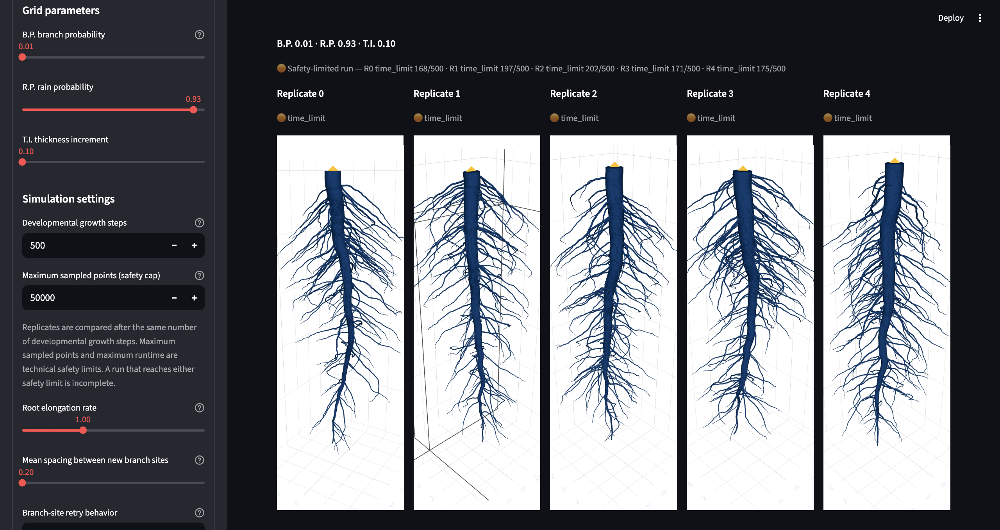
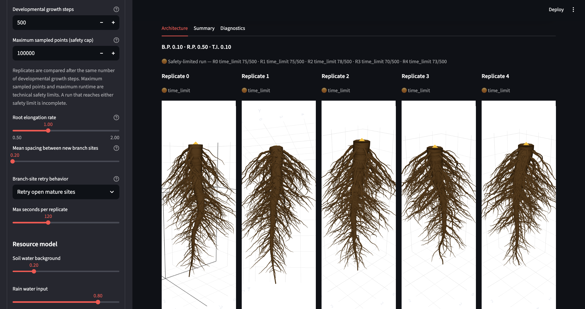
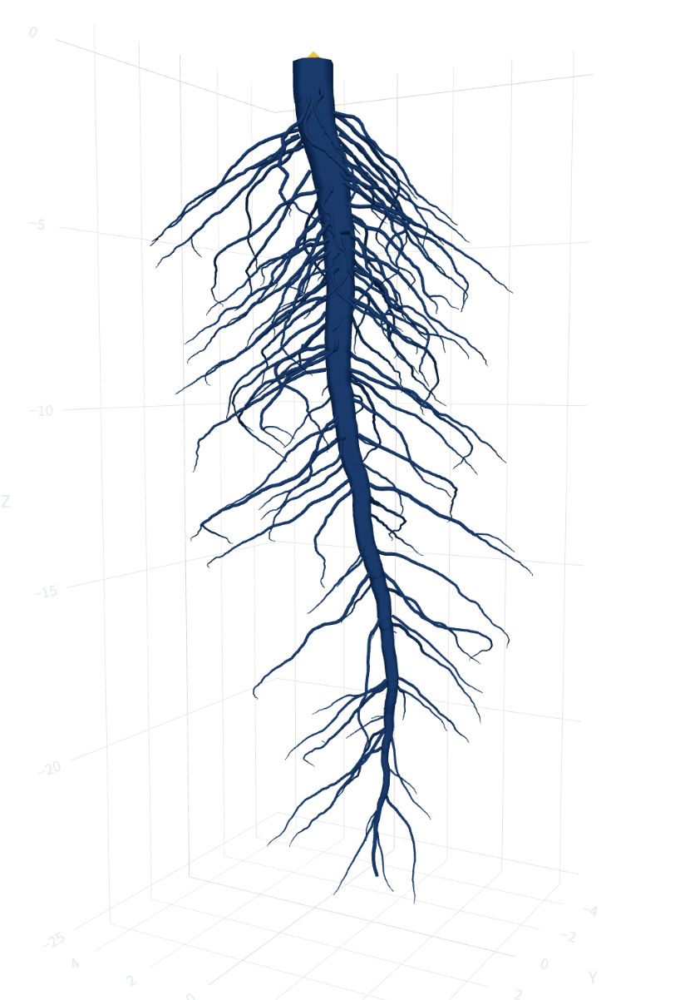

# Root Architecture Visualizer

An interactive scientific-computing application for configuring, running, comparing, and inspecting reproducible 3D root-architecture simulations. The Streamlit interface connects a deterministic simulation engine to Plotly-based 3D rendering, quantitative summaries, scientific diagnostics, and optional Slurm/HPC execution.

## Application Capabilities

- Configure developmental duration, elongation, branching, rainfall, thickness, resources, and safety limits.
- Run and compare five deterministic replicates under one parameter configuration.
- Render scientific radius profiles as physical tapered tubes or scalable centerlines.
- Inspect roots by single color, Horton-Strahler order, or branch generation.
- Review quantitative architecture summaries, diagnostics, and downloadable metrics.
- Submit, monitor, cancel, and resume five-task Slurm arrays for larger experiments.
- Load lossless result bundles with rendering-only levels of detail.
- Validate the application and rendering layer with automated tests.

## Screenshots

### Interactive Root Architecture Viewer



### Root Architecture Visualization



### Detailed Architecture View

<p align="center">
  
</p>

## Installation

The validated release environment uses Python 3.14.5. Exact package versions from that environment are recorded in `requirements.txt`; test-only dependencies are recorded in `requirements-dev.txt`.

```bash
git clone https://github.com/luisferangulob/root-architecture-visualizer.git
cd root-architecture-visualizer

python3 -m venv .venv
source .venv/bin/activate
python -m pip install --upgrade pip
python -m pip install -r requirements.txt
```

Windows PowerShell activation:

```powershell
.venv\Scripts\Activate.ps1
```

## Run the Application

```bash
streamlit run app_elastic_geometry.py
```

Streamlit prints the local URL and normally opens it in a browser.

The repository bundles the validated simulation engine for standalone use. To load another reviewed engine checkout:

```bash
export SINGLE_ROOT_SIM_PATH="/absolute/path/to/single_root_sim.py"
streamlit run app_elastic_geometry.py
```

## Simulation Controls

- **Execution mode:** interactive foreground execution or a Slurm-backed massive run.
- **Branch probability:** one-time site probability or repeated open-site hazard, depending on retry behavior.
- **Rain probability:** rainfall behavior in the resource environment.
- **Thickness increment:** transport-area thickening and local branch capacity.
- **Developmental growth steps:** biological duration shared by all five replicates.
- **Maximum sampled points and runtime:** technical safeguards rather than growth targets.
- **Root elongation rate:** per-step extension scale.
- **Mean branch-site spacing:** expected gap in the continuous material-arc Poisson process.
- **Resource controls:** soil water, rain input, infiltration, phosphorus, nitrogen, and potassium.

## Rendering and Analysis

Physical tapered tubes use the simulator's per-point scientific radii. The faster centerline mode supports larger architectures. Rendering controls can change tube resolution, global display scale, curve smoothing, line width, plot height, category filters, colors, support-point markers, and radius-profile visibility.

Rendering is isolated from simulation state: changing a display setting does not rerun or mutate the scientific result. Shared scales across replicates preserve meaningful visual comparisons.

## HPC Mode

HPC controls configure wall time, partition, memory, CPUs, checkpoint interval, and initial rendering detail. The application writes immutable manifests and submits five-replicate Slurm arrays without blocking the browser.

The included partition names and X-disk convention are site-oriented defaults. They should be adapted for another cluster. `ROOT_HPC_RUNS_DIR` can redirect run storage without changing simulation behavior.

## Relationship to the Simulation Engine

The visualizer loads `single_root_sim.py` directly; it does not reimplement the model. The bundled copy allows a standalone checkout, while the companion [`3d-root-architecture-simulator`](https://github.com/luisferangulob/3d-root-architecture-simulator) repository remains the authoritative simulation and scientific-regression project.

Scientific assumptions and numerical behavior are documented in [docs/model_design.md](docs/model_design.md). Updates to the bundled engine should come from a reviewed simulator release and should be validated in both repositories.

## Testing

Run the visualizer suite from the repository root:

```bash
python -m pip install -r requirements-dev.txt
pytest
```

The suite covers application controls, renderer/source contracts, physical tapered meshes, surface-attached lateral visibility, shared radius scaling, source compilation, and headless Streamlit startup.

## Repository Structure

```text
root-architecture-visualizer/
├── assets/
│   └── screenshots/
│       ├── root-architecture-view-1.png
│       ├── root-architecture-view-2.png
│       └── root-architecture-view-3.png
├── docs/
│   └── model_design.md
├── tests/
│   └── test_visualizer.py
├── .gitignore
├── README.md
├── app_elastic_geometry.py
├── pytest.ini
├── requirements-dev.txt
├── requirements.txt
├── root_hpc_manager.py
├── root_hpc_storage.py
├── root_hpc_worker.py
└── single_root_sim.py
```

- `app_elastic_geometry.py` contains the Streamlit interface and Plotly rendering pipeline.
- `single_root_sim.py` is the bundled simulation engine.
- `root_hpc_manager.py` manages Slurm run lifecycles.
- `root_hpc_worker.py` executes one Slurm-array replicate.
- `root_hpc_storage.py` manages checkpoints and lossless result bundles.
- `tests/test_visualizer.py` owns the application and rendering regression suite.

## Technical Stack

- Python
- Streamlit
- Plotly
- pandas
- NumPy and SciPy
- pytest
- psutil
- Optional Slurm integration

## Limitations

- Interactive mode executes five simulations and can be expensive at large settings.
- Browser rendering cost grows with architecture size and mesh detail.
- HPC features require Slurm and cluster-specific configuration.
- The application is coupled to the bundled schema-v26 result contract.
- A live hosted deployment is not included.

## Research Context

This software was developed as part of computational research into three-dimensional root system architecture at the University of Arizona. This statement describes the research context and does not imply institutional endorsement.

## Author

**Luis Angulo**
